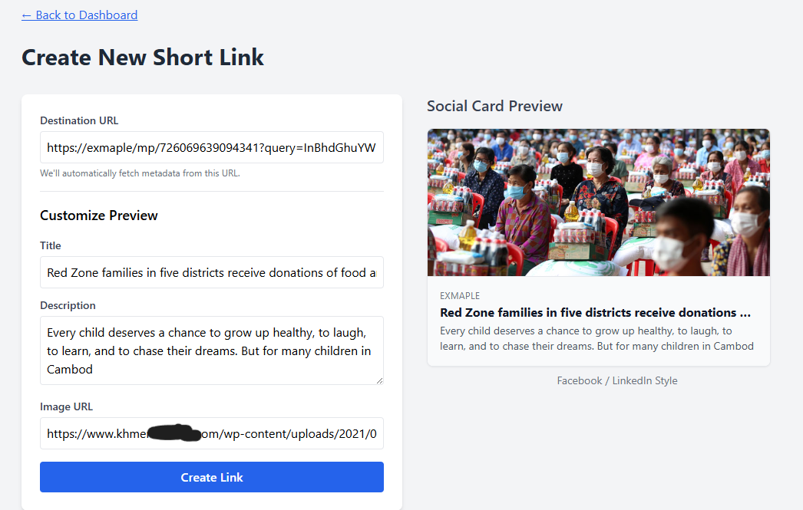
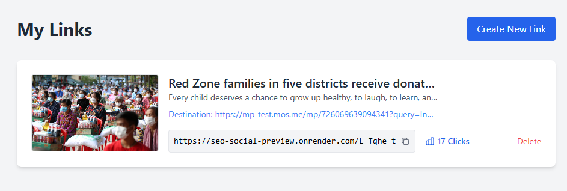
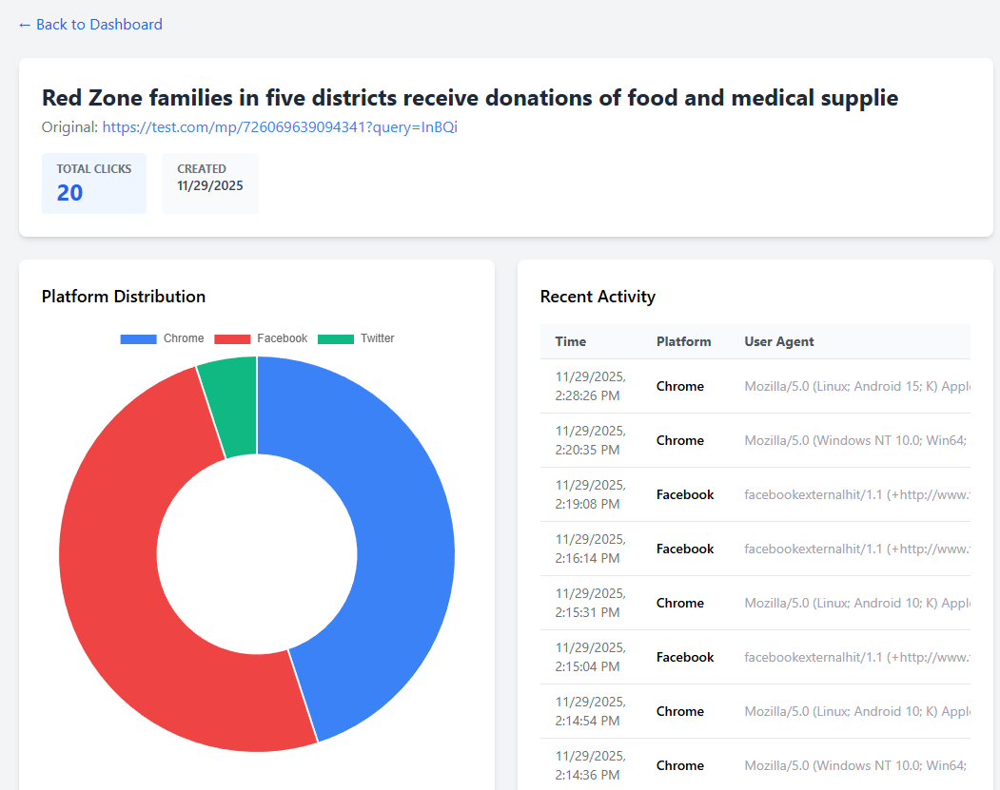
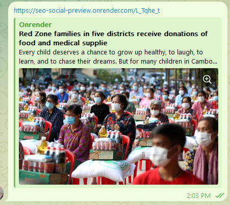

# Social SEO Preview Service

A link shortening service that generates rich social media previews (Open Graph/Twitter Card) for any URL. It detects social media bots and serves them a dynamic HTML page with optimized meta tags, while redirecting regular users to the destination URL.

## Why This Project Was Created

Social media previews are crucial, but client-side apps (like CRA) often fail to provide them because bots don't execute JavaScript. This project acts as an intermediary, generating short links, scraping metadata, serving dynamic HTML previews to bots, and redirecting real users. This ensures rich social media previews for any URL without complex SSR.

## Solution for Client-Side Rendered Apps (e.g., CRA) and Mobile Apps

This service helps client-side rendered (CSR) apps like CRA and mobile apps overcome challenges with social media previews. For CSR apps, it generates rich previews by detecting bots and serving dynamic HTML with meta tags, then redirects users to the original app. For mobile apps, it allows generating short links with custom metadata for deep links, ensuring consistent rich previews on social media. This boosts visibility and engagement for both.

## Features

- **Short Link Generation**: Create short, memorable links.
- **Rich Social Previews**: Automatically extracts Open Graph tags, Twitter Cards, and images from the destination URL.
- **Customization**: Override titles, descriptions, and images for your previews.
- **Bot Detection**: Smartly differentiates between social bots (Facebook, Twitter, LinkedIn, WhatsApp, etc.) and real users.
- **Analytics**: Track clicks, referrer platforms, and user agents.
- **Dashboard**: Manage your links and view analytics.

## Tech Stack

- **AI Assistance**: Gemini 3 Pro, GPT 5
- **Backend**: Node.js, Express, TypeScript
- **Database**: SQLite (via Prisma ORM) - *Easily switchable to PostgreSQL*
- **Frontend**: HTML, Tailwind CSS (CDN), Vanilla JS
- **Tools**: Cheerio (scraping), nanoid (short codes), Chart.js (analytics)

## Getting Started

### Prerequisites

- Node.js (v16+)
- npm

### Installation

1. Clone the repository:

    ```bash
    git clone https://github.com/yourusername/seo-social-preview.git
    cd seo-social-preview
    ```

2. Install dependencies:

    ```bash
    npm install
    ```

3. Initialize the database:

    ```bash
    npx prisma migrate dev --name init
    ```

4. Start the server:

    ```bash
    npm run dev
    ```

    The server will start at `http://localhost:3000`.

### Build for Production

```bash
npm run build
npm start
```

## Usage

### Frontend Client

1. **Dashboard** (`/`):
    - View all your created links.
    - See total clicks at a glance.
    - Click on the click count to view detailed analytics.

2. **Create Link** (`/create.html`):
    - Enter a destination URL.
    - The system automatically fetches metadata.
    - Customize the Title, Description, and Image URL if desired.
    - See a live preview of how the card will look on Facebook/LinkedIn.

3. **Analytics** (`/analytics.html?id=LINK_ID`):
    - View total clicks and creation date.
    - **Platform Distribution**: Chart showing which platforms (Facebook, Twitter, etc.) are accessing your link.
    - **Recent Activity**: A log of the latest clicks with timestamps and user agents.

### API Endpoints

#### 1. Create a Link

**POST** `/api/links`

**Body:**

```json
{
  "originalUrl": "https://example.com",
  "title": "Custom Title (Optional)",
  "description": "Custom Description (Optional)",
  "imageUrl": "https://example.com/image.png (Optional)"
}
```

**Response:**

```json
{
  "id": "uuid",
  "shortCode": "abc12345",
  "originalUrl": "https://example.com",
  "title": "...",
  "description": "...",
  "imageUrl": "...",
  "clicks": 0,
  "createdAt": "..."
}
```

#### 2. Get All Links

**GET** `/api/links`

Returns an array of all links created.

#### 3. Get Link Details & Analytics

**GET** `/api/links/:id`

Returns the link object including an `analytics` array with history.

#### 4. Delete a Link

**DELETE** `/api/links/:id`

Deletes the link and its analytics history.

## Project Structure

```
├── src/
│   ├── index.ts                 # Server entry
│   ├── routes/                  # API & Redirect routes
│   ├── services/                # Business logic (Link, Metadata, UserAgent)
│   ├── utils/                   # Helpers
│   └── templates/               # HTML Templates (Social Preview)
├── public/                      # Frontend Static Files
│   ├── index.html               # Dashboard
│   ├── create.html              # Create Link Page
│   └── analytics.html           # Analytics Page
├── prisma/                      # Database Schema
└── dist/                        # Compiled output
```

### Screenshots

- **Create Link Page:**
  
- **Dashboard (List of Links):**
  
- **Analytics Dashboard:**
  
- **Telegram Preview Example:**
  

## License

MIT
